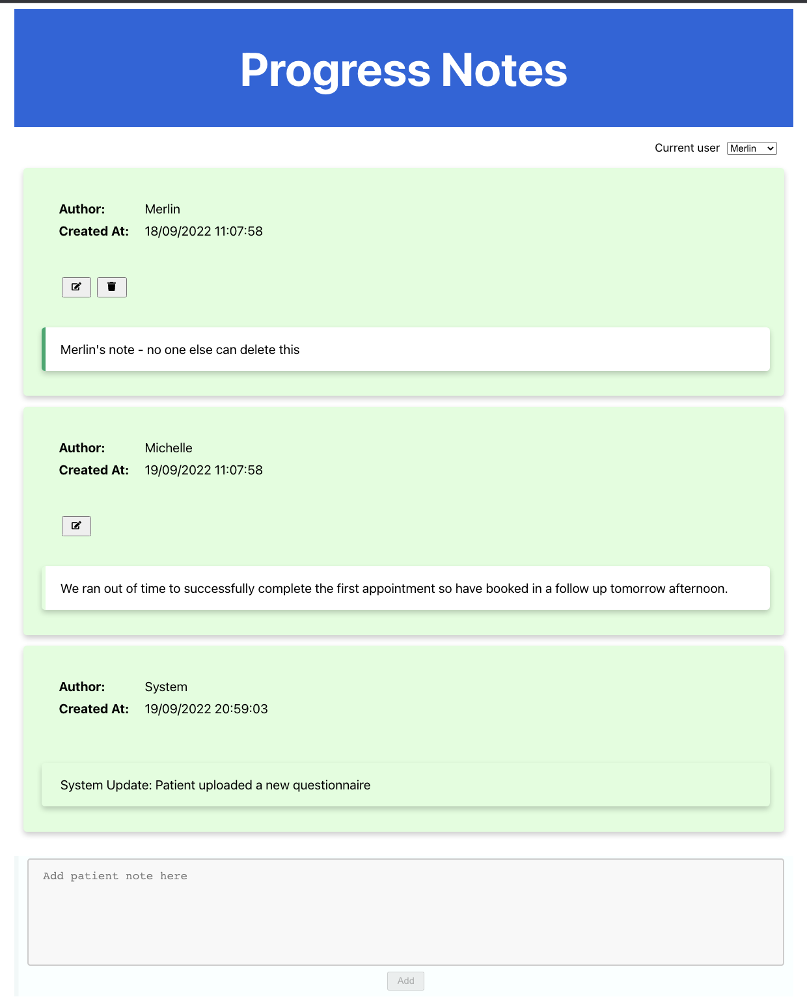

# Patient Progress Notes

A demo to show a Patient Progress Notes app

### Notes List pulling data from fake API
[Demo with fake backend](https://octoberclub.github.io/progress-notes-demo/)

### Requirements

The value of this feature is to create a single place to see the current status and history of a patient as they progress through their care journey. 

Some requirements: 
- Progress notes need to be listed in chronological order 
- Progress notes should be easy to read 
- It should be quick and easy for clinicians to add new notes 
- Some notes are automatically generated by the system (eg. the patient has submitted a questionnaire) 
- Some notes are written by clinicians (eg. “We ran out of time to successfully complete the first appointment so have booked in a follow up tomorrow afternoon.” 
- Multiple clinicians can work with a single patient, so understanding who wrote a note and when they did it is essential 
- Notes written by clinicians can be edited (by any user), notes generated by the system cannot. 
- Notes written by clinicians can be deleted (by their author), notes generated by the system cannot. 

This project was bootstrapped with [Create React App](https://github.com/facebook/create-react-app).

## Available Scripts

In the project directory, you can run:

### `npm start`

Runs the app in the development mode.\
Open [http://localhost:3000](http://localhost:3000) to view it in the browser.

The page will reload if you make edits.\
You will also see any lint errors in the console.

### `npm test`

Launches the test runner in the interactive watch mode.\
See the section about [running tests](https://facebook.github.io/create-react-app/docs/running-tests) for more information.

### `npm run build`

Builds the app for production to the `build` folder.\
It correctly bundles React in production mode and optimizes the build for the best performance.

The build is minified and the filenames include the hashes.\
Your app is ready to be deployed!

See the section about [deployment](https://facebook.github.io/create-react-app/docs/deployment) for more information.

### `npm run deploy`

Deploy the latest version of the code to gihub pages

Application will be available here [https://octoberclub.github.io/progress-notes-demo/](https://octoberclub.github.io/progress-notes-demo/)

## Backend json-server

Run the api test server on port 3001 using [json-server](https://github.com/typicode/json-server)

### `npx json-server --watch db.json --port=3001`

View the /GET notes mock rest endpoint
[http://localhost:3001/notes](http://localhost:3000/notes)

If you get the error `Proxy error: Could not proxy request /notes/ from localhost:3000 to http://localhost:3001` please check you have the above server running peoperly and look at [json-server](https://github.com/typicode/json-server) documentation

## Learn More

You can learn more in the [Create React App documentation](https://facebook.github.io/create-react-app/docs/getting-started).

To learn React, check out the [React documentation](https://reactjs.org/).
